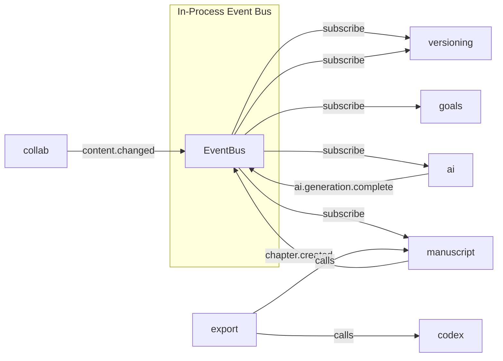

# Prose Arc — Technical Architecture Document

> **Stack:** React · FastAPI · Celery + Redis · PostgreSQL · GCS (Google Cloud Storage)  
> **Architecture:** Modular monolith  
> **Pricing:** One-time purchase (core) + optional AI subscription  
> **Date:** 2026-02-28

---

## Table of Contents

1. [Feature Scope & Prioritization](#1-feature-scope--prioritization)
2. [Modular Monolith Architecture](#2-modular-monolith-architecture)
3. [Data Architecture](#3-data-architecture)
4. [API Design](#4-api-design)
5. [Celery Task Design](#5-celery-task-design)
6. [Infrastructure Overview](#6-infrastructure-overview)
7. [Cost Optimization Strategies](#7-cost-optimization-strategies)

---

## 1. Feature Scope & Prioritization

The prioritization is driven by market gaps: **unified writing + plotting** is the wedge, **AI** is the monetization engine, **collaboration** is the moat.

### P0 — Launch (MVP, months 1–6)

| Feature | Description | Rationale |
|---------|-------------|-----------|
| **Rich text editor** | TipTap-based block editor with markdown shortcuts, inline formatting, comments | Core product. Non-negotiable. |
| **Binder / tree view** | Hierarchical document tree (Book → Part → Chapter → Scene). Drag-drop reorder. | Scrivener's #1 feature. Authors expect this. |
| **Basic outlining** | Per-scene synopsis cards, chapter summaries, kanban board view | Unifies plotting + writing — our key differentiator vs Scrivener |
| **Worldbuilding codex** | Structured entries: Characters, Locations, Items, Lore, Custom types. Rich text + metadata fields. | Novelcrafter charges subscription for this. We include it in one-time purchase. |
| **Snapshots & version history** | Manual snapshots + auto-save. View/restore any snapshot. Diff view between snapshots. | Authors' #1 fear is losing work. Competitors do this poorly. |
| **Word count goals** | Daily/project/session targets with streak tracking | Table stakes |
| **Export: DOCX / PDF / ePub** | Templated export with style presets (manuscript format, paperback, ebook) | Must ship at launch or no one switches |
| **Focus / distraction-free mode** | Typewriter scroll, ambient themes, hide UI chrome | Expected by every serious writing tool |
| **User auth & billing** | Email/OAuth login, one-time purchase via Stripe, AI subscription tier | Revenue |
| **Web app** | Full-featured SPA, works in modern browsers | Primary platform |

### P1 — Growth (months 6–12)

| Feature | Description | Rationale |
|---------|-------------|-----------|
| **AI-assisted writing** | BYOK (OpenAI/Anthropic/local) + built-in credits. Modes: brainstorm, draft, expand, revise, style-match. Context-aware (reads codex + outline + prior chapters). | Monetization engine. Subscription add-on. |
| **Story structure templates** | Save the Cat, 3-Act, Hero's Journey, Kishotenketsu, custom. Visual beat sheet overlay. | Plottr's core value, but we integrate it into the editor. |
| **Visual timeline** | Horizontal timeline of events across multiple storylines/POVs. Drag to reorder. | No competitor does this well inside the writing tool. |
| **Character arcs & relationship maps** | Arc planner per character (want/need/flaw/growth). Force-directed graph for relationships. | Plottr feature brought inside the writing environment. |
| **Series support** | Series-level codex, cross-book character/timeline tracking, shared worldbuilding | Scrivener makes you manage this manually across projects. |
| **Split editor** | Side-by-side panes: chapter + codex, chapter + outline, two chapters | Power-user feature, high retention impact |
| **Track changes** | Suggest mode with accept/reject. Per-paragraph attribution. | Needed before collaboration |
| **Desktop app (Tauri)** | Offline-capable wrapper with local SQLite sync | Authors want offline. Tauri over Electron — smaller binary, lower RAM. |

### P2 — Moat (months 12–18+)

| Feature | Description | Rationale |
|---------|-------------|-----------|
| **Real-time collaboration** | CRDT-based co-editing (Yjs). Cursor presence, live comments. | Hard to build, but massive moat once done. |
| **Beta reader portal** | Invite-only read access with inline feedback, structured questionnaires per chapter, sentiment tracking | No competitor has this. Authors currently use Google Docs. |
| **Direct publishing** | Push to KDP, IngramSpark, Draft2Digital via API. Metadata, keywords, categories. | Atticus does formatting but not submission. |
| **Query letter generator** | AI-powered synopsis/query/pitch generation from manuscript + codex | Nice-to-have, high perceived value |
| **Mobile app** | React Native or PWA. Read/edit/annotate on phone/tablet. | "Later" — authors primarily write on desktop/laptop |
| **Marketplace** | Community templates (structure, export styles, codex schemas) | Ecosystem play |

---

## 2. Modular Monolith Architecture

### Design Principles

1. **Module = bounded context.** Each module owns its domain, database tables, and internal logic.
2. **Communication via in-process event bus** (not HTTP). Modules publish domain events; others subscribe. This is a function call, not a network hop.
3. **Shared kernel is minimal:** user identity, base entity types, event bus interface.
4. **No cross-module direct DB joins.** Modules expose query interfaces. If module A needs data from module B, it calls B's internal API (Python function), not B's tables.
5. **Single deployable.** One FastAPI process, one Docker image. Modules are Python packages under `app/modules/`.

### Module Map

```
app/
├── core/                  # Shared kernel
│   ├── auth.py            # JWT, session, current_user
│   ├── events.py          # In-process event bus (publish/subscribe)
│   ├── db.py              # SQLAlchemy engine, base model
│   ├── storage.py         # GCS abstraction
│   └── models.py          # Base entity (id, timestamps, tenant_id)
│
├── modules/
│   ├── identity/          # Auth, users, teams, billing, permissions
│   ├── manuscript/        # Binder tree, chapters, scenes, editor content
│   ├── codex/             # Worldbuilding: characters, locations, items, lore
│   ├── plotting/          # Outlines, timelines, structure templates, arcs
│   ├── versioning/        # Snapshots, diffs, branches, restore
│   ├── ai/                # AI orchestration, prompt assembly, BYOK key mgmt
│   ├── collab/            # Real-time sync (Yjs), comments, track changes
│   ├── export/            # DOCX/PDF/ePub generation, templates
│   ├── publishing/        # KDP/IngramSpark integration, metadata
│   ├── goals/             # Word count targets, streaks, analytics
│   └── notifications/     # Email, in-app, webhooks
│
├── api/                   # FastAPI routers (thin layer, delegates to modules)
│   ├── v1/
│   │   ├── manuscripts.py
│   │   ├── codex.py
│   │   ├── plotting.py
│   │   ├── ai.py
│   │   ├── collab.py
│   │   ├── export.py
│   │   └── ...
│   └── deps.py            # Dependency injection
│
├── tasks/                 # Celery task definitions (thin, call module services)
│   ├── ai_tasks.py
│   ├── export_tasks.py
│   └── ...
│
└── main.py                # FastAPI app, startup, middleware
```

### Inter-Module Communication



**Event bus implementation:** Simple synchronous pub/sub in-process. Not Kafka. Not RabbitMQ. A Python class with `publish(event_type, payload)` and `subscribe(event_type, handler)`. Handlers run in the same request context. For async side effects (AI generation, export), the handler enqueues a Celery task.

```python
# core/events.py
class EventBus:
    _handlers: dict[str, list[Callable]] = defaultdict(list)

    @classmethod
    def subscribe(cls, event_type: str, handler: Callable):
        cls._handlers[event_type].append(handler)

    @classmethod
    def publish(cls, event_type: str, payload: dict):
        for handler in cls._handlers[event_type]:
            handler(payload)  # sync — keep fast
```

**Why not message queues between modules?** Because it's a monolith. Adding network hops between modules that share a process is over-engineering. If we ever extract a module to a service, we swap the in-process call for an HTTP/gRPC call behind the same interface.

### Module Boundaries — What Each Owns

| Module | Tables Owned | Key Responsibilities |
|--------|-------------|---------------------|
| **identity** | `users`, `teams`, `team_members`, `subscriptions`, `api_keys` | Auth, RBAC, billing webhook handling, BYOK key encryption |
| **manuscript** | `projects`, `binder_nodes`, `documents`, `document_content` | Tree structure, editor content (ProseMirror JSON), project settings |
| **codex** | `codex_entries`, `codex_fields`, `codex_links` | CRUD for worldbuilding entries, cross-linking, tagging |
| **plotting** | `outlines`, `beats`, `timelines`, `timeline_events`, `arcs`, `relationships` | Structure templates, visual timeline data, character arc tracking |
| **versioning** | `snapshots`, `snapshot_deltas` | Create/restore snapshots, compute diffs, branch management |
| **ai** | `ai_sessions`, `ai_messages`, `ai_usage` | Prompt assembly, context window management, usage tracking, BYOK routing |
| **collab** | `collab_sessions`, `comments`, `suggestions` | Yjs document provider, WebSocket management, comment threads |
| **export** | `export_jobs`, `export_templates` | Render pipeline, template management, file generation |
| **publishing** | `publishing_profiles`, `submissions` | Platform API integration, metadata schemas, submission tracking |
| **goals** | `goals`, `writing_sessions`, `streaks` | Target tracking, session logging, analytics |
| **notifications** | `notifications`, `notification_preferences` | Delivery (email/in-app/push), preference management |

---

## 3. Data Architecture

### 3.1 Storage Tiering Strategy

```
┌─────────────────────────────────────────────────────────────┐
│                     STORAGE TIERS                            │
├──────────────┬──────────────────┬───────────────────────────┤
│  PostgreSQL  │  GCS / Object     │  Redis                    │
│  (hot data)  │  (warm/cold)     │  (ephemeral)              │
├──────────────┼──────────────────┼───────────────────────────┤
│ Metadata     │ Snapshot deltas  │ Yjs CRDT docs (active)    │
│ Binder tree  │ Export artifacts │ Session state             │
│ Current doc  │ Uploaded images  │ Rate limits               │
│   content*   │ AI conversation  │ Celery broker + results   │
│ Codex entries│   logs (>30d)    │ Word count live counters  │
│ Relationships│ Published files  │ Presence (who's online)   │
│ User/billing │ Backup dumps     │ Cache (codex, tree)       │
│ Goals/streaks│                  │                           │
└──────────────┴──────────────────┴───────────────────────────┘

* "Current doc content" = latest version of each document stored
  as compressed ProseMirror JSON in Postgres. NOT the full history.
```

**The critical decision: what goes in Postgres vs S3.**

- **Postgres:** Anything you query, join, or filter on. Metadata, relationships, current content.
- **GCS:** Anything large, immutable, or archival. Snapshot deltas, generated files, images, old AI logs.
- **Redis:** Anything ephemeral or real-time. CRDT state, sessions, caches, counters.

### 3.2 Key PostgreSQL Tables

```sql
-- === IDENTITY MODULE ===

CREATE TABLE users (
    id UUID PRIMARY KEY DEFAULT gen_random_uuid(),
    email TEXT UNIQUE NOT NULL,
    password_hash TEXT,           -- NULL if OAuth-only
    display_name TEXT NOT NULL,
    avatar_url TEXT,
    subscription_tier TEXT DEFAULT 'core',  -- 'core' | 'ai_monthly' | 'ai_annual'
    purchase_date TIMESTAMPTZ,
    created_at TIMESTAMPTZ DEFAULT now(),
    updated_at TIMESTAMPTZ DEFAULT now()
);

CREATE TABLE teams (
    id UUID PRIMARY KEY DEFAULT gen_random_uuid(),
    name TEXT NOT NULL,
    owner_id UUID REFERENCES users(id),
    created_at TIMESTAMPTZ DEFAULT now()
);

CREATE TABLE team_members (
    team_id UUID REFERENCES teams(id),
    user_id UUID REFERENCES users(id),
    role TEXT NOT NULL DEFAULT 'member',  -- 'owner' | 'editor' | 'commenter' | 'beta_reader'
    PRIMARY KEY (team_id, user_id)
);

-- === MANUSCRIPT MODULE ===

CREATE TABLE projects (
    id UUID PRIMARY KEY DEFAULT gen_random_uuid(),
    owner_id UUID REFERENCES users(id) NOT NULL,
    team_id UUID REFERENCES teams(id),
    title TEXT NOT NULL,
    series_id UUID REFERENCES projects(id),  -- self-ref for series grouping
    series_order INT,
    settings JSONB DEFAULT '{}',  -- compile settings, editor prefs
    word_count INT DEFAULT 0,     -- denormalized, updated on save
    created_at TIMESTAMPTZ DEFAULT now(),
    updated_at TIMESTAMPTZ DEFAULT now()
);

-- Binder tree — adjacency list with materialized path for fast subtree queries
CREATE TABLE binder_nodes (
    id UUID PRIMARY KEY DEFAULT gen_random_uuid(),
    project_id UUID REFERENCES projects(id) ON DELETE CASCADE NOT NULL,
    parent_id UUID REFERENCES binder_nodes(id),
    node_type TEXT NOT NULL,      -- 'folder' | 'chapter' | 'scene' | 'front_matter' | 'back_matter'
    title TEXT NOT NULL,
    sort_order INT NOT NULL,
    path LTREE NOT NULL,          -- materialized path: 'root.ch1.scene2' (uses pg ltree extension)
    synopsis TEXT,                -- short description for outline view
    metadata JSONB DEFAULT '{}',  -- POV character, status, labels, custom fields
    word_count INT DEFAULT 0,
    created_at TIMESTAMPTZ DEFAULT now(),
    updated_at TIMESTAMPTZ DEFAULT now()
);

CREATE INDEX idx_binder_project ON binder_nodes(project_id);
CREATE INDEX idx_binder_path ON binder_nodes USING GIST(path);

-- Document content — ONE row per binder node (scenes/chapters only)
-- This is the CURRENT version. History lives in versioning module.
CREATE TABLE document_content (
    binder_node_id UUID PRIMARY KEY REFERENCES binder_nodes(id) ON DELETE CASCADE,
    content_prosemirror JSONB,    -- TipTap document JSON (ProseMirror-compatible format)
    content_text TEXT,            -- plain text extracted (for search + word count)
    content_compressed BYTEA,     -- zstd-compressed TipTap JSON for large docs
    byte_size INT,                -- uncompressed size for quota tracking
    updated_at TIMESTAMPTZ DEFAULT now()
);

-- DECISION: We store TipTap JSON (ProseMirror-compatible) in JSONB for documents < 64KB.
-- For documents > 64KB (rare — that's ~12,000 words in one scene), we use
-- content_compressed (zstd BYTEA) and NULL out content_prosemirror.
-- content_text is ALWAYS populated for full-text search.

-- === CODEX MODULE ===

CREATE TABLE codex_entries (
    id UUID PRIMARY KEY DEFAULT gen_random_uuid(),
    project_id UUID REFERENCES projects(id) ON DELETE CASCADE NOT NULL,
    entry_type TEXT NOT NULL,     -- 'character' | 'location' | 'item' | 'lore' | 'custom'
    name TEXT NOT NULL,
    summary TEXT,                 -- short description
    content JSONB,               -- structured fields (varies by type)
    tags TEXT[] DEFAULT '{}',
    image_url TEXT,              -- S3 URL if user uploaded a reference image
    created_at TIMESTAMPTZ DEFAULT now(),
    updated_at TIMESTAMPTZ DEFAULT now()
);

CREATE TABLE codex_links (
    source_id UUID REFERENCES codex_entries(id) ON DELETE CASCADE,
    target_id UUID REFERENCES codex_entries(id) ON DELETE CASCADE,
    link_type TEXT,              -- 'related' | 'parent_of' | 'ally' | 'enemy' | custom
    metadata JSONB DEFAULT '{}',
    PRIMARY KEY (source_id, target_id)
);

-- Cross-reference: which binder nodes mention which codex entries
CREATE TABLE codex_mentions (
    binder_node_id UUID REFERENCES binder_nodes(id) ON DELETE CASCADE,
    codex_entry_id UUID REFERENCES codex_entries(id) ON DELETE CASCADE,
    PRIMARY KEY (binder_node_id, codex_entry_id)
);

-- === PLOTTING MODULE ===

CREATE TABLE outlines (
    id UUID PRIMARY KEY DEFAULT gen_random_uuid(),
    project_id UUID REFERENCES projects(id) ON DELETE CASCADE NOT NULL,
    template_type TEXT,          -- 'three_act' | 'save_the_cat' | 'heros_journey' | 'custom'
    structure JSONB NOT NULL,    -- template definition: beats, act breaks
    created_at TIMESTAMPTZ DEFAULT now()
);

CREATE TABLE beats (
    id UUID PRIMARY KEY DEFAULT gen_random_uuid(),
    outline_id UUID REFERENCES outlines(id) ON DELETE CASCADE NOT NULL,
    binder_node_id UUID REFERENCES binder_nodes(id), -- links beat to actual chapter/scene
    label TEXT NOT NULL,
    description TEXT,
    act INT,
    sort_order INT NOT NULL,
    metadata JSONB DEFAULT '{}'
);

CREATE TABLE timelines (
    id UUID PRIMARY KEY DEFAULT gen_random_uuid(),
    project_id UUID REFERENCES projects(id) ON DELETE CASCADE NOT NULL,
    name TEXT NOT NULL,
    settings JSONB DEFAULT '{}'  -- time scale, display options
);

CREATE TABLE timeline_events (
    id UUID PRIMARY KEY DEFAULT gen_random_uuid(),
    timeline_id UUID REFERENCES timelines(id) ON DELETE CASCADE NOT NULL,
    binder_node_id UUID REFERENCES binder_nodes(id),
    codex_entry_ids UUID[] DEFAULT '{}',  -- characters involved
    title TEXT NOT NULL,
    description TEXT,
    story_time JSONB NOT NULL,   -- flexible: {year, month, day, hour} or {relative_order}
    storyline TEXT,              -- POV/subplot grouping
    sort_order INT NOT NULL
);

CREATE TABLE character_arcs (
    id UUID PRIMARY KEY DEFAULT gen_random_uuid(),
    project_id UUID REFERENCES projects(id) ON DELETE CASCADE NOT NULL,
    codex_entry_id UUID REFERENCES codex_entries(id) NOT NULL,
    arc_type TEXT,               -- 'positive' | 'negative' | 'flat'
    want TEXT,
    need TEXT,
    flaw TEXT,
    ghost TEXT,                  -- backstory wound
    arc_beats JSONB DEFAULT '[]' -- [{beat_id, description, emotional_state}]
);

CREATE TABLE relationships (
    id UUID PRIMARY KEY DEFAULT gen_random_uuid(),
    project_id UUID REFERENCES projects(id) ON DELETE CASCADE NOT NULL,
    source_entry_id UUID REFERENCES codex_entries(id) ON DELETE CASCADE,
    target_entry_id UUID REFERENCES codex_entries(id) ON DELETE CASCADE,
    relationship_type TEXT NOT NULL,
    description TEXT,
    dynamic JSONB DEFAULT '[]'   -- how it changes: [{beat_id, state}]
);

-- === VERSIONING MODULE ===

CREATE TABLE snapshots (
    id UUID PRIMARY KEY DEFAULT gen_random_uuid(),
    project_id UUID REFERENCES projects(id) ON DELETE CASCADE NOT NULL,
    binder_node_id UUID REFERENCES binder_nodes(id),  -- NULL = project-level snapshot
    name TEXT,                    -- user-provided label
    snapshot_type TEXT NOT NULL,  -- 'manual' | 'auto' | 'pre_ai' | 'branch_point'
    parent_snapshot_id UUID REFERENCES snapshots(id),
    word_count INT,
    created_at TIMESTAMPTZ DEFAULT now()
);

-- Deltas stored in S3, only pointer here
CREATE TABLE snapshot_deltas (
    id UUID PRIMARY KEY DEFAULT gen_random_uuid(),
    snapshot_id UUID REFERENCES snapshots(id) ON DELETE CASCADE NOT NULL,
    binder_node_id UUID REFERENCES binder_nodes(id) NOT NULL,
    delta_gcs_key TEXT NOT NULL,  -- GCS key for compressed JSON diff
    delta_size_bytes INT,         -- for storage tracking
    base_snapshot_id UUID REFERENCES snapshots(id)  -- what this delta is relative to
);

-- === AI MODULE ===

CREATE TABLE ai_sessions (
    id UUID PRIMARY KEY DEFAULT gen_random_uuid(),
    project_id UUID REFERENCES projects(id) ON DELETE CASCADE NOT NULL,
    user_id UUID REFERENCES users(id) NOT NULL,
    mode TEXT NOT NULL,           -- 'brainstorm' | 'draft' | 'expand' | 'revise' | 'style_match'
    context_config JSONB,        -- what was included in context window
    model_used TEXT,
    created_at TIMESTAMPTZ DEFAULT now()
);

CREATE TABLE ai_messages (
    id UUID PRIMARY KEY DEFAULT gen_random_uuid(),
    session_id UUID REFERENCES ai_sessions(id) ON DELETE CASCADE NOT NULL,
    role TEXT NOT NULL,           -- 'user' | 'assistant' | 'system'
    content TEXT NOT NULL,
    tokens_in INT,
    tokens_out INT,
    cost_cents INT,              -- tracked for usage billing
    created_at TIMESTAMPTZ DEFAULT now()
);

-- Aggregated usage for billing
CREATE TABLE ai_usage (
    id UUID PRIMARY KEY DEFAULT gen_random_uuid(),
    user_id UUID REFERENCES users(id) NOT NULL,
    period TEXT NOT NULL,         -- '2026-02' (monthly)
    tokens_used BIGINT DEFAULT 0,
    cost_cents INT DEFAULT 0,
    UNIQUE (user_id, period)
);

-- === COLLAB MODULE ===

CREATE TABLE comments (
    id UUID PRIMARY KEY DEFAULT gen_random_uuid(),
    binder_node_id UUID REFERENCES binder_nodes(id) ON DELETE CASCADE NOT NULL,
    user_id UUID REFERENCES users(id) NOT NULL,
    parent_comment_id UUID REFERENCES comments(id), -- threading
    anchor_from INT,             -- text position range
    anchor_to INT,
    body TEXT NOT NULL,
    resolved BOOLEAN DEFAULT FALSE,
    created_at TIMESTAMPTZ DEFAULT now()
);

CREATE TABLE suggestions (
    id UUID PRIMARY KEY DEFAULT gen_random_uuid(),
    binder_node_id UUID REFERENCES binder_nodes(id) ON DELETE CASCADE NOT NULL,
    user_id UUID REFERENCES users(id) NOT NULL,
    original_text TEXT,
    suggested_text TEXT,
    anchor_from INT,
    anchor_to INT,
    status TEXT DEFAULT 'pending', -- 'pending' | 'accepted' | 'rejected'
    created_at TIMESTAMPTZ DEFAULT now()
);

-- === EXPORT MODULE ===

CREATE TABLE export_jobs (
    id UUID PRIMARY KEY DEFAULT gen_random_uuid(),
    project_id UUID REFERENCES projects(id) NOT NULL,
    user_id UUID REFERENCES users(id) NOT NULL,
    format TEXT NOT NULL,         -- 'docx' | 'pdf' | 'epub'
    template_id UUID,
    status TEXT DEFAULT 'pending', -- 'pending' | 'processing' | 'complete' | 'failed'
    output_gcs_key TEXT,         -- result file in GCS
    output_size_bytes INT,
    error_message TEXT,
    expires_at TIMESTAMPTZ,      -- auto-delete from S3 after N days
    created_at TIMESTAMPTZ DEFAULT now()
);

-- === GOALS MODULE ===

CREATE TABLE goals (
    id UUID PRIMARY KEY DEFAULT gen_random_uuid(),
    user_id UUID REFERENCES users(id) NOT NULL,
    project_id UUID REFERENCES projects(id),
    goal_type TEXT NOT NULL,      -- 'daily' | 'project' | 'session'
    target_words INT NOT NULL,
    deadline DATE,
    created_at TIMESTAMPTZ DEFAULT now()
);

CREATE TABLE writing_sessions (
    id UUID PRIMARY KEY DEFAULT gen_random_uuid(),
    user_id UUID REFERENCES users(id) NOT NULL,
    project_id UUID REFERENCES projects(id) NOT NULL,
    started_at TIMESTAMPTZ NOT NULL,
    ended_at TIMESTAMPTZ,
    words_written INT DEFAULT 0,
    words_deleted INT DEFAULT 0,
    net_words INT DEFAULT 0
);
```

### 3.3 Storage Cost Optimization — Deep Dive

#### Delta-Based Versioning

We do **NOT** store full document copies for each snapshot. Instead:

```
Snapshot Chain:
  S0 (full) → S1 (delta from S0) → S2 (delta from S1) → ... → S9 (delta from S8) → S10 (full, keyframe)

Every 10th snapshot is a full "keyframe." Everything between is a delta.
```

**Delta format:** JSON diff (RFC 6902 JSON Patch) of the ProseMirror document. Typically 90–98% smaller than the full document.

**Storage location:** Deltas go to S3 (not Postgres). Postgres stores only the pointer (`delta_s3_key`) and metadata.

**Compression:** All deltas and keyframes are zstd-compressed before S3 upload. ProseMirror JSON compresses ~70–80% with zstd.

**Estimated savings:** A 100K-word novel (~400KB ProseMirror JSON) with 200 snapshots:
- Naive full copies: 200 × 400KB = 80MB
- Delta + keyframe (every 10): 20 × 400KB × 0.25 (compressed) + 180 × 8KB (avg delta, compressed) = 2MB + 1.4MB = **3.4MB** (~96% reduction)

#### Collaborative Editing: Yjs CRDT

For P2 real-time collaboration, we use **Yjs** (CRDT library):

- **Active documents:** Yjs state vector held in Redis. Updated on every keystroke via WebSocket.
- **Persistence:** On session end (or every 60s), the Yjs document is merged back into ProseMirror JSON and saved to `document_content`. The Yjs state vector is flushed from Redis.
- **Why not OT?** CRDTs don't need a central server to resolve conflicts. This lets us use a stateless WebSocket layer that just relays updates. Cheaper to scale.
- **Storage:** We do NOT persist Yjs update logs long-term. We persist the resolved document. This avoids the unbounded growth problem of CRDT history.

#### Content Compression Strategy

```
Document Size     | Storage Strategy
─────────────────────────────────────────────────
< 64KB (~12K words) | JSONB in Postgres (content_prosemirror column)
≥ 64KB              | zstd-compressed BYTEA in Postgres (content_compressed column)
Images/media        | S3, reference by URL
Export artifacts    | S3, auto-expire after 7 days
AI conversation logs| Postgres for 30 days, then batch-archive to S3
```

#### Deduplication

- **Codex images:** Hash-based dedup. Before uploading to S3, compute SHA-256. If hash exists, reuse the existing S3 object. Store hash in `codex_entries.image_hash`.
- **Export templates:** Shared templates stored once. User customizations stored as diffs from base template.
- **AI prompts:** System prompt templates stored once. Per-request context assembled on the fly, not persisted.

#### Blob Offloading Rules

| Data Type | Where | Why |
|-----------|-------|-----|
| Profile avatars | GCS + CDN | Static, public, cacheable |
| Codex images | GCS | User-uploaded, potentially large |
| Snapshot deltas | GCS | Archival, accessed rarely |
| Export outputs | GCS, 7-day TTL | Generated artifacts, re-creatable |
| Published files | GCS | Could be large ePub/PDFs |
| AI conversation logs > 30d | GCS (Coldline/Archive) | Compliance, rarely accessed |

### 3.4 Redis Usage

| Key Pattern | Purpose | TTL |
|-------------|---------|-----|
| `yjs:{doc_id}` | CRDT state for active collaborative docs | Flush on session end |
| `presence:{project_id}` | Who's online in a project | 60s refresh |
| `session:{session_id}` | User session data | 24h |
| `cache:codex:{project_id}` | Cached codex for AI context assembly | 5min |
| `cache:tree:{project_id}` | Cached binder tree | 5min |
| `wc:{user_id}:{date}` | Live word count accumulator | 48h |
| `ratelimit:ai:{user_id}` | AI request rate limiting | Sliding window |
| `celery` | Task broker queues | Managed by Celery |

---

## 4. API Design

All routes prefixed with `/api/v1/`. Auth via Bearer JWT. Project-scoped routes require `project_id` in path.

### Identity Module

```
POST   /auth/register
POST   /auth/login
POST   /auth/refresh
POST   /auth/oauth/{provider}      # Google, GitHub
GET    /users/me
PATCH  /users/me
POST   /users/me/api-keys          # BYOK AI key management
DELETE /users/me/api-keys/{key_id}
GET    /billing/status
POST   /billing/checkout            # Stripe checkout session
POST   /billing/webhook             # Stripe webhook
```

### Manuscript Module

```
# Projects
GET    /projects
POST   /projects
GET    /projects/{project_id}
PATCH  /projects/{project_id}
DELETE /projects/{project_id}

# Binder tree
GET    /projects/{project_id}/binder
POST   /projects/{project_id}/binder               # create node
PATCH  /projects/{project_id}/binder/{node_id}      # rename, move, reorder
DELETE /projects/{project_id}/binder/{node_id}
POST   /projects/{project_id}/binder/reorder        # bulk reorder (drag-drop)

# Document content
GET    /projects/{project_id}/documents/{node_id}
PUT    /projects/{project_id}/documents/{node_id}   # save content
GET    /projects/{project_id}/documents/{node_id}/text  # plain text (for search)

# Search
GET    /projects/{project_id}/search?q=...          # full-text search across docs + codex
```

### Codex Module

```
GET    /projects/{project_id}/codex
POST   /projects/{project_id}/codex
GET    /projects/{project_id}/codex/{entry_id}
PATCH  /projects/{project_id}/codex/{entry_id}
DELETE /projects/{project_id}/codex/{entry_id}
GET    /projects/{project_id}/codex/{entry_id}/mentions  # which scenes reference this entry
POST   /projects/{project_id}/codex/link                 # create relationship between entries
DELETE /projects/{project_id}/codex/link/{link_id}
POST   /projects/{project_id}/codex/{entry_id}/image     # upload reference image
```

### Plotting Module

```
# Outlines
GET    /projects/{project_id}/outlines
POST   /projects/{project_id}/outlines
PATCH  /projects/{project_id}/outlines/{outline_id}

# Beats
GET    /projects/{project_id}/outlines/{outline_id}/beats
POST   /projects/{project_id}/outlines/{outline_id}/beats
PATCH  /projects/{project_id}/beats/{beat_id}
POST   /projects/{project_id}/beats/reorder

# Timelines
GET    /projects/{project_id}/timelines
POST   /projects/{project_id}/timelines
GET    /projects/{project_id}/timelines/{timeline_id}/events
POST   /projects/{project_id}/timelines/{timeline_id}/events
PATCH  /projects/{project_id}/timeline-events/{event_id}

# Character arcs
GET    /projects/{project_id}/arcs
POST   /projects/{project_id}/arcs
PATCH  /projects/{project_id}/arcs/{arc_id}

# Relationships (graph data)
GET    /projects/{project_id}/relationships
POST   /projects/{project_id}/relationships
PATCH  /projects/{project_id}/relationships/{rel_id}

# Templates (global)
GET    /templates/structures               # Save the Cat, 3-Act, etc.
```

### Versioning Module

```
GET    /projects/{project_id}/snapshots
POST   /projects/{project_id}/snapshots                    # manual snapshot
GET    /projects/{project_id}/snapshots/{snapshot_id}
GET    /projects/{project_id}/snapshots/{snapshot_id}/diff  # diff against current or another snapshot
POST   /projects/{project_id}/snapshots/{snapshot_id}/restore
DELETE /projects/{project_id}/snapshots/{snapshot_id}

# Document-level snapshots
GET    /projects/{project_id}/documents/{node_id}/history
```

### AI Module

```
POST   /projects/{project_id}/ai/sessions          # start AI session (brainstorm, draft, etc.)
POST   /projects/{project_id}/ai/sessions/{session_id}/messages  # send message, get response
GET    /projects/{project_id}/ai/sessions/{session_id}
GET    /projects/{project_id}/ai/sessions           # list sessions

# Context preview — see what the AI will "know" before sending
GET    /projects/{project_id}/ai/context-preview?mode=draft&node_id=...

# Usage
GET    /ai/usage                                     # current period usage + limits
```

### Collaboration Module

```
# WebSocket endpoint for real-time editing
WS     /ws/collab/{project_id}/{node_id}

# Comments
GET    /projects/{project_id}/documents/{node_id}/comments
POST   /projects/{project_id}/documents/{node_id}/comments
PATCH  /projects/{project_id}/comments/{comment_id}
POST   /projects/{project_id}/comments/{comment_id}/resolve

# Suggestions (track changes)
GET    /projects/{project_id}/documents/{node_id}/suggestions
POST   /projects/{project_id}/documents/{node_id}/suggestions
POST   /projects/{project_id}/suggestions/{suggestion_id}/accept
POST   /projects/{project_id}/suggestions/{suggestion_id}/reject

# Beta reader portal
POST   /projects/{project_id}/beta-invites          # generate invite link
GET    /beta/{invite_token}                          # accept invite, get read access
POST   /beta/{invite_token}/feedback                 # submit structured feedback
```

### Export Module

```
POST   /projects/{project_id}/export                # start export job (async)
GET    /export/{job_id}                              # poll status
GET    /export/{job_id}/download                     # get signed GCS URL

GET    /export/templates                             # list available templates
POST   /export/templates                             # create custom template
```

### Publishing Module

```
POST   /projects/{project_id}/publish/validate       # check metadata completeness
POST   /projects/{project_id}/publish/{platform}      # submit to KDP, IngramSpark, etc.
GET    /projects/{project_id}/publish/status
GET    /projects/{project_id}/metadata
PATCH  /projects/{project_id}/metadata
```

### Goals Module

```
GET    /goals
POST   /goals
PATCH  /goals/{goal_id}
DELETE /goals/{goal_id}
GET    /goals/stats?range=30d                        # writing analytics
GET    /goals/streak                                 # current streak info
POST   /goals/sessions/start                         # begin writing session
POST   /goals/sessions/{session_id}/end
```

---

## 5. Celery Task Design

### Queue Architecture

```
┌─────────────────────────────────────────────┐
│              Redis Broker                    │
├───────────┬───────────┬─────────────────────┤
│  default  │  ai       │  export             │
│  queue    │  queue    │  queue              │
├───────────┼───────────┼─────────────────────┤
│ • notifs  │ • gen     │ • docx render       │
│ • cleanup │ • context │ • pdf render        │
│ • stats   │   assembly│ • epub render       │
│ • index   │ • style   │ • publish submit    │
│           │   match   │                     │
└─────┬─────┴─────┬─────┴──────────┬──────────┘
      │           │                │
   Workers(2)  Workers(2-N)    Workers(2)
   (CPU-light) (IO-bound,     (CPU-moderate,
                auto-scale)    memory-hungry)
```

**Three separate queues** because the workloads have different profiles:

- **`default`**: Fast, CPU-light tasks. Fixed 2 workers.
- **`ai`**: IO-bound (waiting on LLM API responses). Scale horizontally based on queue depth. Rate-limited per user.
- **`export`**: CPU/memory intensive (rendering PDFs, ePubs). Fixed 2 workers, can burst.

### Task Catalog

```python
# === AI TASKS (queue='ai') ===

@celery.task(queue='ai', rate_limit='10/m', bind=True, max_retries=3)
def ai_generate(self, session_id: str, message: str, context_config: dict):
    """
    Assemble context window (codex entries, outline beats, prior chapters),
    call LLM API (BYOK or built-in), stream response back via WebSocket,
    persist to ai_messages, update usage counters.
    """

@celery.task(queue='ai')
def ai_style_analysis(project_id: str, sample_node_ids: list[str]):
    """
    Analyze writing style from sample chapters. Extract voice profile
    (sentence length distribution, vocabulary level, POV patterns, tense).
    Store as project-level style_profile JSONB.
    """

@celery.task(queue='ai')
def ai_codex_suggest(project_id: str, node_id: str):
    """
    After a chapter is saved, scan for new character/location/item mentions
    not yet in codex. Suggest new entries. Notify user in-app.
    """

# === EXPORT TASKS (queue='export') ===

@celery.task(queue='export', bind=True, max_retries=2)
def export_document(self, job_id: str):
    """
    Pull binder tree + all document content + codex (for glossary) +
    export template. Render to target format. Upload to GCS.
    Update export_jobs.status and output_gcs_key.
    Set expires_at = now() + 7 days.
    """

@celery.task(queue='export')
def publish_to_platform(submission_id: str, platform: str):
    """
    Package manuscript + metadata + cover image. Submit via platform API
    (KDP, IngramSpark, Draft2Digital). Update submissions table with
    status/tracking info. Retry on transient failures.
    """

# === DEFAULT TASKS (queue='default') ===

@celery.task(queue='default')
def create_auto_snapshot(project_id: str, node_id: str):
    """
    Called after document save. Compute delta from last snapshot.
    If delta is non-trivial (>50 chars changed), compress and store in GCS.
    Create snapshot record. Maintain keyframe every 10th snapshot.
    """

@celery.task(queue='default')
def update_word_counts(project_id: str, node_id: str, new_text: str):
    """
    Recount words for the document. Update binder_nodes.word_count,
    projects.word_count (aggregate). Update daily writing_sessions.
    """

@celery.task(queue='default')
def reindex_search(project_id: str, node_id: str):
    """
    Update document_content.content_text (plain text extraction).
    Update any search indexes (Postgres full-text tsvector).
    """

@celery.task(queue='default')
def send_notification(user_id: str, notification_type: str, payload: dict):
    """
    Deliver notification via configured channel(s): in-app DB insert,
    email (via SendGrid/SES), push (if mobile later).
    """

@celery.task(queue='default')
def cleanup_expired_exports():
    """
    Periodic (celery beat, daily). Find export_jobs past expires_at.
    Delete GCS objects. Mark job as 'expired'.
    """

@celery.task(queue='default')
def archive_old_ai_logs():
    """
    Periodic (celery beat, weekly). Move ai_messages older than 30 days
    to GCS (batch JSONL, compressed). Delete from Postgres.
    """

@celery.task(queue='default')
def flush_yjs_to_postgres(project_id: str, node_id: str):
    """
    Called periodically (every 60s for active collab docs) and on session end.
    Read Yjs state from Redis, convert to ProseMirror JSON, save to document_content.
    """
```

### Celery Beat Schedule

```python
beat_schedule = {
    'cleanup-expired-exports': {
        'task': 'tasks.export_tasks.cleanup_expired_exports',
        'schedule': crontab(hour=3, minute=0),  # 3 AM daily
    },
    'archive-old-ai-logs': {
        'task': 'tasks.ai_tasks.archive_old_ai_logs',
        'schedule': crontab(hour=4, minute=0, day_of_week=0),  # Sunday 4 AM
    },
    'aggregate-daily-stats': {
        'task': 'tasks.default_tasks.aggregate_daily_stats',
        'schedule': crontab(hour=0, minute=5),  # 12:05 AM daily
    },
}
```

---

## 6. Infrastructure Overview

### Deployment Topology

```
                            ┌──────────────┐
                            │   Cloud CDN   │
                            │   + Cloud     │
                            │   Armor (WAF) │
                            └──────┬───────┘
                                   │
                    ┌──────────────┴──────────────┐
                    │    GCP Load Balancer          │
                    │    (Global HTTP(S) LB)        │
                    └──────┬──────────────┬────────┘
                           │              │
                  ┌────────┴───┐  ┌───────┴────────┐
                  │  FastAPI    │  │  FastAPI        │
                  │  (web + API)│  │  (web + API)    │
                  │  + WS       │  │  + WS           │
                  └──────┬─────┘  └───────┬─────────┘
                         │                │
          ┌──────────────┼────────────────┼──────────────┐
          │              │                │              │
   ┌──────┴──┐    ┌──────┴──┐     ┌──────┴──┐    ┌─────┴────┐
   │PostgreSQL│    │  Redis   │     │   GCS    │    │ Celery   │
   │(Cloud SQL│    │(Memorystr│     │          │    │ Workers  │
   │ 1 writer │    │  1 node) │     │          │    │ 3 queues │
   │ 1 reader │    │          │     │          │    │          │
   └──────────┘    └──────────┘     └──────────┘    └──────────┘
```

### Recommended Cloud Setup (GCP)

| Component | Service | Sizing (Launch) | Cost Estimate/mo |
|-----------|---------|-----------------|-----------------|
| **FastAPI** | Cloud Run (2 instances, min 1 always-on) | 2 vCPU, 4GB RAM each | ~$100 |
| **PostgreSQL** | Cloud SQL for PostgreSQL (db-custom-2-4096) | 2 vCPU, 4GB, 100GB SSD | ~$80 |
| **Redis** | Memorystore for Redis (Basic, M1) | 1 node, 1GB | ~$35 |
| **GCS** | Standard + Nearline lifecycle | Pay per use | ~$5–15 |
| **Celery workers** | Cloud Run Jobs or GCE (e2-small × 3 queues) | 1 vCPU, 2GB each × 3 queues | ~$75 |
| **CDN** | Cloud CDN (or Cloudflare free/pro in front) | — | $0–20 |
| **Email** | SendGrid (via GCP Marketplace) or Mailgun | Pay per send | ~$1 |
| **Monitoring** | Cloud Monitoring + Cloud Logging + Sentry | — | ~$25 |
| **Total** | | | **~$340–370/mo** |

> **GCP Cost Notes:**
> - **Cloud Run** is ideal for FastAPI — auto-scales to zero for non-WebSocket workloads, pay-per-request. For WebSocket (collab), keep min instances = 1 with CPU always allocated.
> - **Cloud SQL** is slightly more expensive than AWS RDS for equivalent specs, but includes automated backups and HA options.
> - **Memorystore** is pricier than ElastiCache — consider **self-managed Redis on a small GCE instance** (~$15/mo) if budget is tight.
> - **Cloud Run Jobs** are great for Celery-like batch work (export, AI) — spin up on demand, pay only for execution time. Alternatively, use GCE preemptible/spot VMs for persistent Celery workers at ~60-70% discount.
> - **GCS** pricing is competitive with S3. Nearline ($0.01/GB/mo) replaces S3-IA, Coldline ($0.004/GB/mo) replaces Glacier.

### Scaling Considerations

**What scales first:** AI worker queue. When AI subscription uptake grows, add Celery AI workers. They're stateless and IO-bound, so horizontal scaling is trivial.

**Database scaling path:**
1. Start with single Cloud SQL instance + read replica.
2. Add PgBouncer (or Cloud SQL Auth Proxy with connection pooling) when connection count becomes an issue.
3. Partition `writing_sessions` and `ai_messages` by month (time-series data).
4. If Postgres becomes the bottleneck for search, add a dedicated search index (Meilisearch or pg_trgm + GIN indexes first).

**WebSocket scaling:** For real-time collab, WebSocket connections are sticky to a server. Use Redis pub/sub to broadcast Yjs updates across FastAPI instances. Each instance subscribes to channels for its active documents.

```
User A (Server 1) ──keystroke──▶ Redis PubSub ──▶ Server 2 ──▶ User B
```

**Frontend:** React SPA served from CDN. Zero server load for static assets.

### Desktop App (Tauri)

- Bundles a lightweight WebView pointing at the web app.
- **Offline mode:** Embeds SQLite for local storage. Syncs via a conflict-resolution protocol when back online.
- Sync protocol: Client sends change log (timestamped ops) → Server applies with last-write-wins per field, except for document content which uses Yjs CRDT merge.
- Binary size: ~15MB (vs Electron's ~150MB).

---

## 7. Cost Optimization Strategies

### Storage

| Strategy | Estimated Savings | Implementation |
|----------|------------------|----------------|
| **Delta-based versioning** | ~96% vs full copies | JSON Patch diffs, keyframes every 10 snapshots |
| **Zstd compression** | ~70–80% on JSON | Compress before Postgres BYTEA and GCS upload |
| **GCS lifecycle policies** | ~60% on archival data | Standard → Nearline after 30d, Coldline after 90d for old AI logs |
| **Export TTL (7 days)** | Eliminates unbounded growth | Celery beat cleanup + GCS lifecycle |
| **Image deduplication** | Variable | SHA-256 hash check before upload |
| **Don't persist Yjs history** | Massive | Flush to ProseMirror JSON, discard CRDT ops |
| **Conditional compression** | Optimal balance | < 64KB: JSONB (queryable). ≥ 64KB: zstd BYTEA |
| **Committed Use Discounts** | 20-57% on Cloud SQL/GCE | GCP CUDs for predictable baseline workloads |

**Per-user storage budget estimate:**
- Average novel: ~400KB (current content) + ~3.4MB (200 snapshots) + ~2MB (codex, images, metadata) ≈ **6MB**
- Heavy user with 10 projects, lots of images: ~100MB
- At $0.020/GB/month (GCS Standard): 100MB = $0.002/month per heavy user. **Storage cost is negligible.**

### Compute

| Strategy | Detail |
|----------|--------|
| **GCE Spot VMs for Celery workers** | 60–91% savings on export and default queues. AI queue stays on-demand (latency-sensitive). |
| **Auto-scale AI workers on queue depth** | Scale to zero when no AI tasks. Use Cloud Run Jobs for burst AI workloads. |
| **Connection pooling (PgBouncer / Cloud SQL Auth Proxy)** | Reduce Cloud SQL instance size by handling more concurrent users per connection. |
| **CDN for static assets** | Cloudflare free tier. Zero origin load for JS/CSS/images. |
| **Lazy-load document content** | Don't fetch document bodies on binder tree load. Fetch on open. |
| **WebSocket connection limits** | Max 3 concurrent collab docs per user. Idle timeout at 30 min. |

### AI Cost Optimization

This is the most important section because AI is the recurring revenue driver AND the biggest variable cost.

| Strategy | Detail |
|----------|--------|
| **BYOK as default recommendation** | Users bring their own API keys → zero LLM cost to us. Market this as "use your own keys, keep your data private." |
| **Smart context assembly** | Don't dump the entire novel into the context window. Use relevance scoring: current chapter + directly linked codex entries + outline beats for current act + style profile. Cap at ~8K tokens of context. |
| **Prompt caching** | Use provider prompt caching (Anthropic, OpenAI) — system prompt + codex context stays cached across turns in a session. 50–90% cost reduction on input tokens. |
| **Model tiering** | Brainstorm mode → fast/cheap model (GPT-4o-mini, Haiku). Draft/revise → capable model (GPT-4o, Sonnet). Let users choose. Default to cheap. |
| **Token budgets** | Built-in credits = monthly token allocation per subscription tier. Hard cap. Overage either stops or charges extra. |
| **Batch non-urgent AI tasks** | Style analysis, codex suggestions → can run on cheaper batch APIs (OpenAI Batch API = 50% discount). |
| **Cache common generations** | Template-based generations (query letters, blurbs) for similar inputs → cache results with content hash key. |
| **Streaming responses** | Stream AI output to user via WebSocket. Better UX + user can cancel mid-generation (saves tokens). |

### AI Pricing Model (Suggestion)

```
Core (one-time $79):
  - No AI features
  - Everything else included forever

AI Starter ($9/month):
  - 100K tokens/month (~50 brainstorm sessions or ~20 draft generations)
  - Bring your own key: unlimited (we just orchestrate)

AI Pro ($24/month):
  - 500K tokens/month
  - Priority processing
  - Advanced models (GPT-4o, Claude Sonnet)
  - Style matching
  - BYOK: unlimited

AI tokens are MUCH cheaper than you think to provision:
  - 500K tokens at GPT-4o-mini ≈ $0.15 cost to us
  - 500K tokens at GPT-4o ≈ $2.50 cost to us
  - Blended (80% mini, 20% full) ≈ $0.62 cost to us
  - At $24/month, that's 97% gross margin on AI
```

### Database Cost Optimization

| Strategy | Detail |
|----------|--------|
| **Table partitioning** | `writing_sessions` and `ai_messages` partitioned by month. Drop old partitions instead of DELETE (instant, no vacuum). |
| **TOAST compression** | Postgres auto-TOASTs large JSONB values. We get this for free on `content_prosemirror`. |
| **Partial indexes** | `CREATE INDEX ON export_jobs(status) WHERE status = 'pending'` — only index what you query. |
| **Aggressive vacuuming** | `document_content` gets updated frequently. Configure autovacuum aggressively for this table. |
| **Read replica for analytics** | Route goals/stats/search queries to Cloud SQL read replica. Keep write primary lean. |

---

## Appendix A: Module Dependency Matrix

```
             identity  manuscript  codex  plotting  versioning  ai  collab  export  publishing  goals  notifications
identity        -          -         -       -         -         -     -       -        -         -         -
manuscript      R          -         -       -         -         -     -       -        -         -         -
codex           R          R         -       -         -         -     -       -        -         -         -
plotting        R          R         R       -         -         -     -       -        -         -         -
versioning      R          R         -       -         -         -     -       -        -         -         -
ai              R          R         R       R         -         -     -       -        -         -         -
collab          R          R         -       -         -         -     -       -        -         -         -
export          R          R         R       -         -         -     -       -        -         -         -
publishing      R          R         -       -         -         -     -       R        -         -         -
goals           R          R         -       -         -         -     -       -        -         -         -
notifications   R          -         -       -         -         -     -       -        -         -         -

R = reads from (via module's query interface, NOT direct DB access)
```

**Rule:** Dependencies flow downward. No cycles. `identity` and `manuscript` are foundational. `ai` is the most connected consumer (reads codex, outline, manuscript for context assembly).

## Appendix B: Key Technical Decisions Log

| Decision | Choice | Alternatives Considered | Rationale |
|----------|--------|------------------------|-----------|
| Editor framework | TipTap | ProseMirror (raw), Slate, Lexical | React-first API; ships all required extensions (underline, subscript, superscript, text-align, link, image, table, colour, highlight) as npm packages. `@tiptap/extension-collaboration` provides Yjs integration for Phase 3a. Raw ProseMirror was abandoned after Vite/ESM incompatibilities and maintenance overhead of the custom schema/keymap/inputrules layer. TipTap produces identical ProseMirror JSON — no backend migration required. |
| CRDT library | Yjs | Automerge, Diamond Types | Yjs has proven ProseMirror binding, good perf, active maintenance. Battle-tested at scale (e.g., Hocuspocus). |
| Desktop framework | Tauri | Electron | 10x smaller binary, lower memory. Rust backend can also handle local SQLite for offline. |
| Versioning | Delta (JSON Patch) | Full copies, OT log | 96% storage savings. JSON Patch is standardized, easy to apply forward/backward. |
| In-process event bus | Custom sync pub/sub | Kafka, RabbitMQ, Redis Streams | It's a monolith. No network hops needed. If we extract services later, swap implementation behind the interface. |
| Object storage | GCS (Google Cloud Storage) | Postgres large objects, filesystem | Infinite scale, pay-per-use, lifecycle policies, Cloud CDN integration. |
| Compression | zstd | gzip, lz4, brotli | Best ratio-to-speed tradeoff. Native Python bindings (pyzstd). |
| Search | Postgres full-text (tsvector + GIN) | Elasticsearch, Meilisearch | Good enough for launch. Authors search within one project at a time. Avoids another service to manage. Upgrade to Meilisearch if needed. |
| Auth | JWT (short-lived) + refresh tokens | Session cookies | Better for API-first design. Desktop/mobile clients need token-based auth. |

---

*This document is a living artifact. Update it as decisions are validated or invalidated during implementation.*
